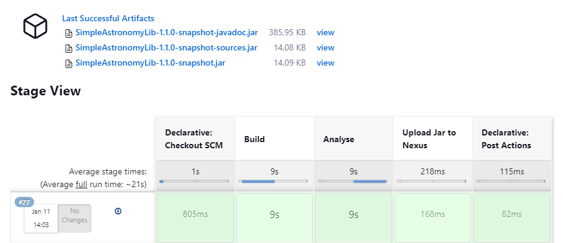
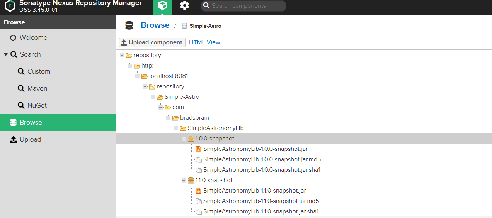

Groupe Jenkins: FONTAINE Matthieu BODDAERT Gauthier GOSSET Titouan VANDELANOITTE Arthur

# Sujet: Simple Astronomy

## Problèmes rencontrés:
- mauvaise version de java => réinstaller une version compatible et changer les variables d'environnement
- Rédaction jenkinsfile:
    - problème aux étapes clean & package dans Jenkins => changer sh -> bat
    - problème pour faire rouler la commande mvn spotbugs:spotbugs -> pas de préfix spotbugs => bat mvn spotbugs:spotbugs -> bat mvn com.github.spotbugs:spotbugs-maven-plugin:3.1.7:spotbugs
    - problème pour configurer JUnit => doublon de version dans le plugin

## Étapes réalisées:
- fork du projet
- git clone
- mvn package dans le projet
- lancer une instance Jenkins avec la commande java -jar jenkins.war
- à l'adresse localhost:8080 accéder au panneau de configuration jenkins
- créer un projet pipeline avec le projet github
- lancer un build
- configurer un Jenkinsfile (problème rencontré)
- build réussi
- ajout de la dépendance junit pour les tests unitaire dans le pom
- ajout du plugin spotbugs pour les tests statiques dans le pom
- ajout d'une étape 'Analyse' avec spotbugs pour les tests statiques
- ajout d'une étape pour les tests unitaire avec JUnit
- génaration d'un report des tests
- génération des artéfacts
- installation de nexus
- instance de serveur nexus OSS à localhost:8081
- installation du plugin nexus dans Jenkins
- ajout d'une étape Upload to nexus

- Success build

- publication d'un package sur nexus

